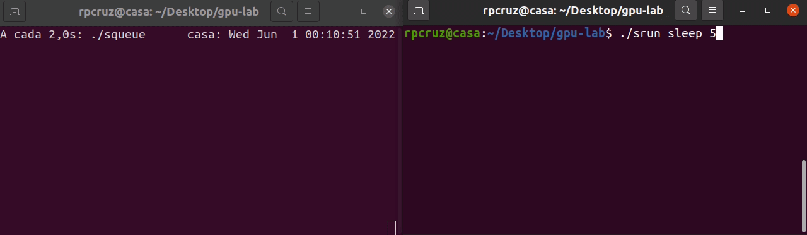

# gpu-lab
Simple scheduler for GPU sharing.

**Warning:** This is a prototype, it is not fully functional yet.

**Background:** In small research teams, a challenge arises of how to manage the GPU server(s). Some teams reserve GPUs for each group. Some teams manually choose the GPU using the `CUDA_VISIBLE_DEVICES` environment variables. Some teams (like ours) are using SLURM. SLURM is especially nice when you have more than one server. It has some limitations though: most glaringly, we would like to be able to use the same GPU for more than one job.

**Name conventions:** For familiary reasons, we are using the same terminology as SLURM.

**Commands:**

* `sbatch`: Jobs that run on the background. Unlike SLURM, we give a lower priority to these jobs.
* `srun`: Interactive job, runs immediately if a GPU is available.
* `scancel 123`: Cancel the job number `123`.
* `squeue`: Prints the jobs currently running.
* `sinit`: (admin) Initializes the sqlite3 database.
* `swatchdog`: (admin) Necessary script that (1) kills processes that are using a GPU without permission, (2) takes care of the queue (see `sbatch`).

